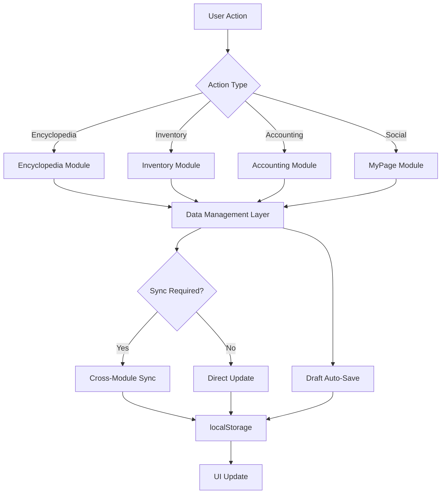
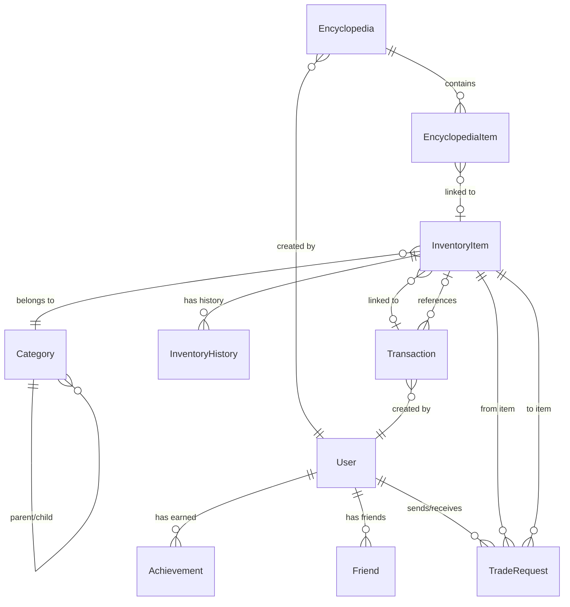

# Design Document: DroSeal Enhanced Features

## Overview

This design document specifies the technical implementation for enhanced features in the DroSeal collection management application. The enhancements build upon the existing React + TypeScript + Vite + Tailwind CSS MVP to add:

- Custom encyclopedia creation with AI-powered OCR
- Hierarchical inventory category management
- Enhanced accounting with business/other income tracking
- Achievement system for user milestones
- Social features including friends and trading
- Draft auto-save and export functionality

The design maintains localStorage as the primary persistence layer while structuring data for future REST API integration. All features are designed to work seamlessly with the existing Encyclopedia, Inventory, Accounting, and MyPage modules.

### Key Design Principles

1. **Data Consistency**: Encyclopedia quantities automatically sync with inventory changes
2. **Progressive Enhancement**: Features work independently but integrate naturally
3. **Future-Ready**: Data structures compatible with backend API migration
4. **User Experience**: Auto-save, inline editing, and responsive feedback
5. **Type Safety**: Full TypeScript coverage with strict type checking

## Architecture

### System Architecture

The application follows a modular frontend architecture with clear separation of concerns:

```
┌─────────────────────────────────────────────────────────────┐
│                     React Application                        │
├─────────────────────────────────────────────────────────────┤
│  ┌──────────────┐  ┌──────────────┐  ┌──────────────┐      │
│  │ Encyclopedia │  │  Inventory   │  │  Accounting  │      │
│  │   Module     │  │   Module     │  │   Module     │      │
│  └──────┬───────┘  └──────┬───────┘  └──────┬───────┘      │
│         │                  │                  │              │
│         └──────────────────┼──────────────────┘              │
│                            │                                 │
│  ┌─────────────────────────▼──────────────────────────┐     │
│  │         Data Management Layer                      │     │
│  │  - State Management (React Context/Hooks)         │     │
│  │  - Data Validation & Business Logic               │     │
│  │  - Cross-Module Synchronization                   │     │
│  └─────────────────────────┬──────────────────────────┘     │
│                            │                                 │
│  ┌─────────────────────────▼──────────────────────────┐     │
│  │         Persistence Layer                          │     │
│  │  - localStorage Adapter                            │     │
│  │  - Draft Auto-Save Service                         │     │
│  │  - Data Versioning & Migration                     │     │
│  └─────────────────────────┬──────────────────────────┘     │
│                            │                                 │
│  ┌─────────────────────────▼──────────────────────────┐     │
│  │         External Services                          │     │
│  │  - OCR Service (AI-powered text extraction)       │     │
│  │  - Image Processing (crop, resize, compress)      │     │
│  │  - Export Service (Excel, PDF generation)         │     │
│  └────────────────────────────────────────────────────┘     │
└─────────────────────────────────────────────────────────────┘
```

### Data Flow Architecture



### Module Responsibilities

**Encyclopedia Module**
- Encyclopedia CRUD operations (create, read, update, delete)
- Grid-based item management with configurable dimensions
- Image upload, cropping, and OCR integration
- Progress calculation and visualization
- Friend encyclopedia comparison
- Draft auto-save for creation workflow

**Inventory Module**
- Hierarchical category management with unlimited depth
- Item CRUD with quantity tracking
- Purchase metadata (price, date, linked encyclopedia)
- Category search and filtering
- Transaction history integration

**Accounting Module**
- Transaction recording (purchases and sales)
- Business income vs. other income classification
- Time-based filtering (monthly, yearly)
- Receipt image attachment
- Export functionality (Excel, PDF)
- Profit calculation with cost tracking

**MyPage Module**
- User profile management
- Friend request system
- Achievement display
- Friend encyclopedia access
- Social interaction hub

**Data Management Layer**
- Centralized state management
- Data validation and business rules
- Cross-module synchronization (encyclopedia ↔ inventory ↔ accounting)
- Achievement trigger detection
- Data versioning for schema evolution

**Persistence Layer**
- localStorage abstraction with quota management
- Draft auto-save with 30-second intervals
- Data serialization/deserialization
- Migration support for schema changes
- Export/import functionality

## Components and Interfaces

### Core Data Types

```typescript
// Encyclopedia Types
interface Encyclopedia {
  id: string
  name: string
  description: string
  type: 'certified' | 'custom'
  visibility: 'public' | 'private'
  gridRows: number
  gridCols: number
  items: EncyclopediaItem[]
  createdBy: string
  createdAt: Date
  updatedAt: Date
}

interface EncyclopediaItem {
  id: string
  encyclopediaId: string
  name: string
  imageUrl: string
  gridPosition: { row: number; col: number }
  inventoryItemId?: string  // Link to inventory
  quantity: number  // Calculated from inventory
  memo?: string
  customProperties: Record<string, string>
}

// Inventory Types
interface Category {
  id: string
  name: string
  parentId?: string
  children?: Category[]
  createdAt: Date
}

interface InventoryItem {
  id: string
  name: string
  categoryId: string
  quantity: number
  purchasePrice?: number
  purchaseDate?: Date
  linkedEncyclopediaId?: string
  imageUrl?: string
  notes?: string
  createdAt: Date
  updatedAt: Date
}

interface InventoryHistory {
  id: string
  inventoryItemId: string
  quantityChange: number
  reason: 'manual' | 'transaction' | 'trade'
  transactionId?: string
  timestamp: Date
  notes?: string
}

// Accounting Types
interface Transaction {
  id: string
  type: 'purchase' | 'sale'
  amount: number
  date: Date
  inventoryItemId?: string
  incomeType?: 'business' | 'other'  // Calculated based on inventory link
  shippingCost?: number
  fee?: number
  receiptImageUrl?: string
  source?: string  // For purchases
  notes?: string
  createdAt: Date
}

// Social Types
interface User {
  id: string
  username: string
  email: string
  bio?: string
  avatarUrl?: string
  achievements: Achievement[]
  createdAt: Date
}

interface Friend {
  id: string
  userId: string
  friendId: string
  status: 'pending' | 'accepted'
  requestedAt: Date
  acceptedAt?: Date
}

interface Achievement {
  id: string
  userId: string
  type: 'first_encyclopedia' | 'first_step' | 'contributor'
  title: string
  description: string
  earnedAt: Date
  metadata?: Record<string, any>
}

interface TradeRequest {
  id: string
  fromUserId: string
  toUserId: string
  fromItemId: string
  toItemId: string
  status: 'pending' | 'accepted' | 'rejected' | 'cancelled'
  message?: string
  createdAt: Date
  respondedAt?: Date
}

// Draft Types
interface EncyclopediaDraft {
  id: string
  name: string
  description: string
  visibility: 'public' | 'private'
  gridRows: number
  gridCols: number
  items: Partial<EncyclopediaItem>[]
  lastSaved: Date
}
```

### Service Interfaces

```typescript
// Storage Service
interface StorageService {
  // Generic CRUD
  get<T>(key: string): T | null
  set<T>(key: string, value: T): void
  remove(key: string): void
  clear(): void
  
  // Quota management
  getUsage(): { used: number; total: number }
  checkQuota(dataSize: number): boolean
  
  // Versioning
  getVersion(): string
  migrate(fromVersion: string, toVersion: string): void
}

// OCR Service
interface OCRService {
  extractText(imageUrl: string): Promise<OCRResult>
}

interface OCRResult {
  success: boolean
  texts: Array<{
    text: string
    confidence: number
    boundingBox: { x: number; y: number; width: number; height: number }
  }>
  warning?: string  // For 20+ items
}

// Image Processing Service
interface ImageService {
  crop(imageUrl: string, region: CropRegion): Promise<string>
  resize(imageUrl: string, maxDimension: number): Promise<string>
  compress(imageUrl: string, quality: number): Promise<string>
}

interface CropRegion {
  x: number
  y: number
  width: number
  height: number
}

// Export Service
interface ExportService {
  exportToExcel(transactions: Transaction[]): Promise<Blob>
  exportToPDF(transactions: Transaction[]): Promise<Blob>
  exportEncyclopedia(encyclopedia: Encyclopedia): Promise<string>  // HTML
}

// Achievement Service
interface AchievementService {
  checkAndAward(userId: string, trigger: AchievementTrigger): Achievement[]
  getAchievements(userId: string): Achievement[]
}

type AchievementTrigger = 
  | { type: 'encyclopedia_created'; visibility: 'public' | 'private' }
  | { type: 'item_registered'; encyclopediaId: string }
  | { type: 'data_adopted'; encyclopediaId: string }

// Draft Service
interface DraftService {
  saveDraft(draft: EncyclopediaDraft): void
  loadDraft(id: string): EncyclopediaDraft | null
  listDrafts(): EncyclopediaDraft[]
  deleteDraft(id: string): void
  startAutoSave(draft: EncyclopediaDraft, interval: number): () => void
}
```

### React Component Structure

```typescript
// Encyclopedia Components
<EncyclopediaList />
  - Displays all encyclopedias with progress
  - Edit/Delete actions
  - Friend list per encyclopedia

<EncyclopediaDetail />
  - Grid display with configurable dimensions
  - Item quantity management
  - Navigation to item detail modal

<EncyclopediaCreate />
  - Manual mode: image upload + cropping
  - AI mode: OCR-powered auto-fill
  - Inline property input with auto-numbering
  - Draft auto-save integration

<EncyclopediaItemModal />
  - Item detail view
  - Memo field
  - Transaction history
  - Friend comparison
  - Trade button

// Inventory Components
<InventoryList />
  - Category tree sidebar
  - Item table with filtering
  - Category search

<CategoryManager />
  - Add/Edit/Delete categories
  - Hierarchical tree view
  - Expand/collapse functionality

<InventoryItemForm />
  - Item creation with metadata
  - Purchase price and date
  - Encyclopedia linking
  - Category selection

// Accounting Components
<AccountingDashboard />
  - Summary cards (expenses, revenue, assets)
  - Time filters (monthly, yearly)
  - Income type breakdown

<TransactionList />
  - Filterable transaction table
  - Business vs. other income indicators
  - Receipt thumbnails

<TransactionForm />
  - Type selection (purchase/sale)
  - Inventory item linking with search
  - Receipt upload
  - Auto-calculation of income type

<ExportButtons />
  - Excel export
  - PDF export

// Social Components
<FriendList />
  - Friend cards with avatars
  - Remove friend action
  - Navigate to friend profile

<FriendRequestList />
  - Pending requests
  - Accept/Reject actions

<AchievementDisplay />
  - Earned achievements with dates
  - Locked achievements (grayed out)

<TradeRequestModal />
  - Item selection from inventory
  - Comparison view
  - Send trade request
```

## Data Models

### localStorage Schema

Data is stored in localStorage with the following key structure:

```
droseal:version                    // Schema version for migrations
droseal:user:{userId}              // User profile
droseal:encyclopedias              // Array of all encyclopedias
droseal:encyclopedia:{id}          // Individual encyclopedia data
droseal:encyclopedia_items:{id}    // Items for encyclopedia {id}
droseal:inventory:categories       // Category tree
droseal:inventory:items            // Array of inventory items
droseal:inventory:history          // Inventory change history
droseal:accounting:transactions    // Array of transactions
droseal:friends:{userId}           // Friend relationships
droseal:friend_requests:{userId}   // Pending friend requests
droseal:achievements:{userId}      // User achievements
droseal:trade_requests:{userId}    // Trade requests
droseal:drafts:encyclopedia        // Encyclopedia drafts
```

### Data Relationships



### Data Synchronization Rules

**Encyclopedia ↔ Inventory Sync**
- When `InventoryItem.quantity` changes → update linked `EncyclopediaItem.quantity`
- When `EncyclopediaItem` is linked to `InventoryItem` → set `EncyclopediaItem.quantity = InventoryItem.quantity`
- When `EncyclopediaItem` is unlinked → set `EncyclopediaItem.quantity = 0`

**Inventory ↔ Accounting Sync**
- When `Transaction` is created with `inventoryItemId` → create `InventoryHistory` entry
- When `Transaction.type === 'purchase'` and has `inventoryItemId` → set `InventoryItem.purchasePrice`
- When `Transaction.type === 'sale'` and has `inventoryItemId` → calculate `incomeType` based on `InventoryItem.purchasePrice` existence

**Achievement Triggers**
- First public encyclopedia created → award "첫 도감"
- First item registered in any encyclopedia → award "첫 발걸음"
- User data adopted into certified encyclopedia → award contributor achievement

### Data Validation Rules

**Encyclopedia**
- `name`: required, 1-100 characters
- `description`: optional, max 500 characters
- `gridRows`, `gridCols`: 1-50
- `type`: must be 'certified' or 'custom'
- `visibility`: must be 'public' or 'private'

**InventoryItem**
- `name`: required, 1-200 characters
- `quantity`: integer ≥ 0
- `purchasePrice`: optional, number ≥ 0
- `categoryId`: must reference existing category

**Transaction**
- `amount`: required, number > 0
- `date`: required, valid date
- `type`: must be 'purchase' or 'sale'
- `source`: required for purchases
- `incomeType`: auto-calculated, not user-editable

**Category**
- `name`: required, 1-100 characters
- `parentId`: optional, must reference existing category
- Cannot create circular parent-child relationships
- Cannot have duplicate names under same parent

### Migration Strategy

When schema changes are needed:

1. Increment version in `droseal:version`
2. Implement migration function for each version bump
3. On app load, check version and run migrations sequentially
4. Backup data before migration
5. Log migration success/failure

Example migration:

```typescript
const migrations = {
  '1.0.0_to_1.1.0': (data: any) => {
    // Add new field to encyclopedias
    const encyclopedias = data.encyclopedias.map((e: any) => ({
      ...e,
      description: e.description || ''
    }))
    return { ...data, encyclopedias }
  }
}
```

